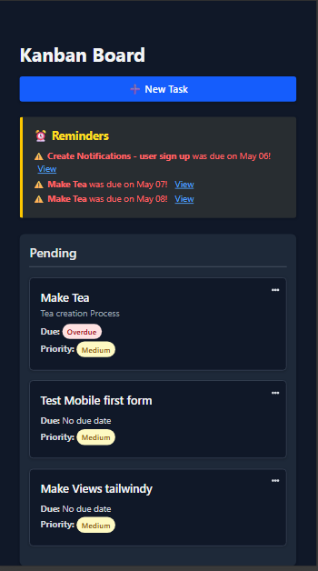
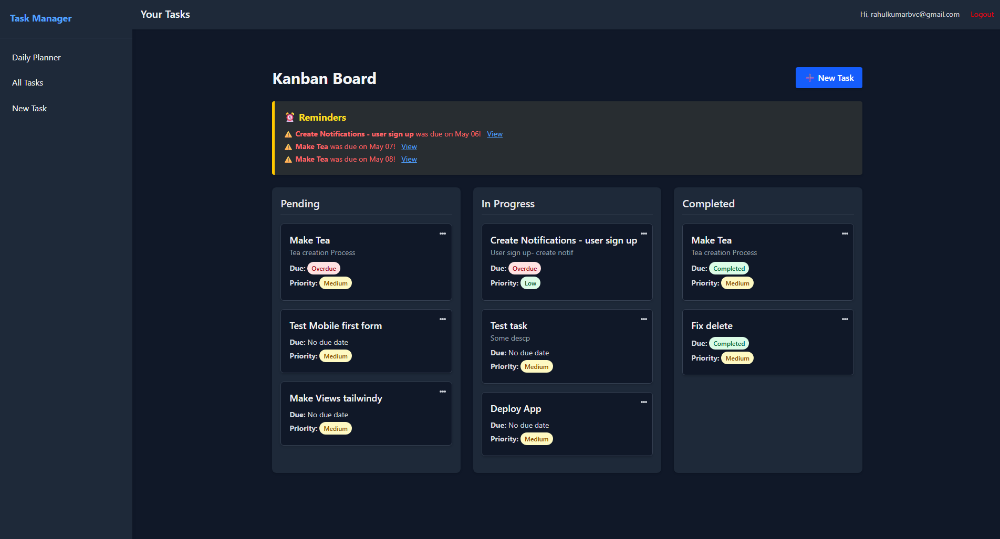

# 📝 Task Manager App (Rails 8 + Tailwind)

A clean, minimal, and mobile-first task manager built with Rails 8 and Tailwind CSS. Easily track your tasks, set priorities, due dates, and stay productive on the go!

---

## ✨ Features

- ✅ User Authentication (Devise-based Login/Signup)
- 📋 CRUD for Tasks (Create, Read, Update, Delete)
- ⏳ Set Task Status (Pending, In Progress, Completed)
- 📅 Set Due Date for each Task
- ⚠️ Set Priority (Low, Medium, High)
- 🔁 Optional Task Recurrence (Daily, Weekly, Monthly)
- 🌙 Dark Mode (auto adapts)
- 📱 Fully Responsive Design for mobile and desktop

---

## 📷 Screenshots

> Add your own screenshots under `/app/assets/images/screenshots` and reference them below:

| Mobile View | Dark Mode |
|-------------|-----------|
|  |  |

---

## 🚀 Getting Started

### 🔧 Prerequisites

- Ruby 3.3+
- Rails 8.0.2
- Node.js & Yarn (for Tailwind)
- SQLite (or preferred DB)

### 📦 Installation

```bash
# 1. Clone the repository
git clone https://github.com/your_username/task-manager-app.git
cd task-manager-app

# 2. Install dependencies
bundle install

# 3. Install JavaScript packages (if using jsbundling)
bin/importmap

# 4. Setup database
bin/rails db:setup

# 5. Run the server
bin/dev
